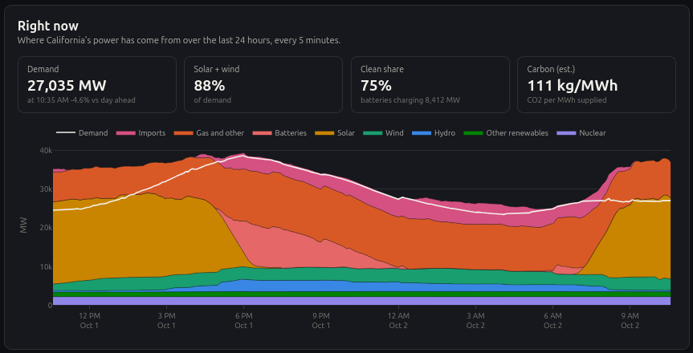
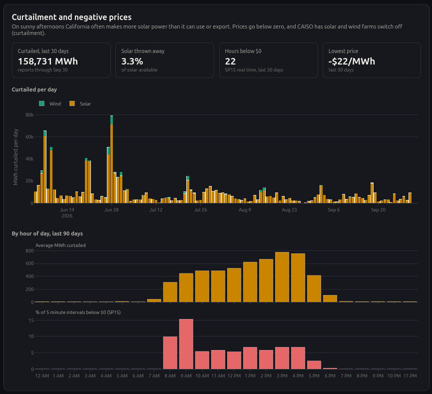
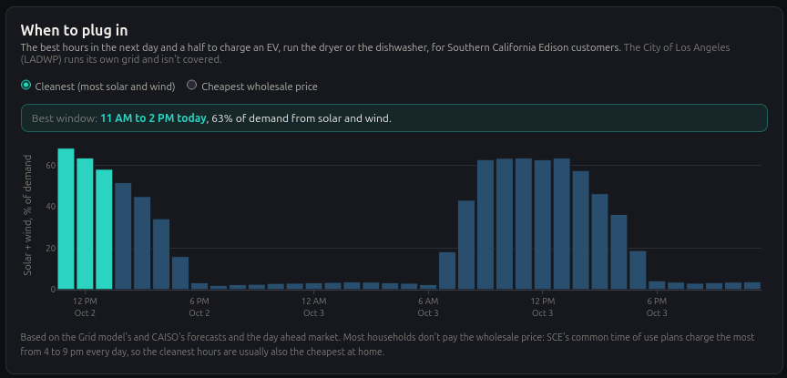
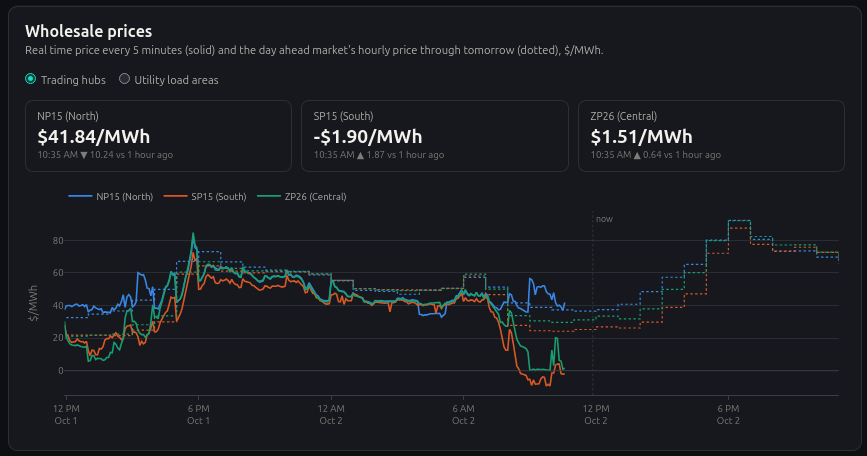
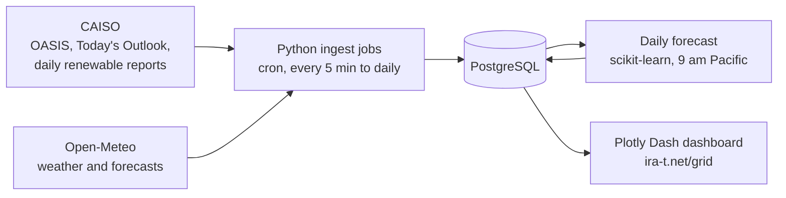

# Grid

**Can a model built only on public data forecast California's power grid as well as the grid operator does?**

Every morning, Grid forecasts the next day's electricity demand, solar output and wind output in California, hour by hour. The forecast is locked in before the day starts, and once the day is over it is graded against what actually happened and against the official day ahead forecast from CAISO, the operator that runs most of California's grid. All of it is public on a live dashboard.

**Live: [ira-t.net/grid](https://ira-t.net/grid/)**

Python · PostgreSQL · scikit-learn · Plotly Dash · AWS Lightsail

## Why these three numbers

California's grid now swings between two problems every day. On sunny afternoons there is more solar power than the state can use, so prices drop below zero and solar farms are told to switch off (curtailment). A few hours later the sun sets, demand peaks, and gas plants and imports have to fill the gap. How bad either problem gets depends on three things: how much power people will use, how much the sun will produce, and how much the wind will produce. Forecasting those well a day ahead is what lets the grid plan for both.

The dashboard is built around that cycle:

| Section | What it shows |
|---|---|
| **Right now** | Where California's power is coming from, every 5 minutes, with the clean share and an estimated carbon intensity |


| **Day ahead forecast** | Tomorrow's demand, solar and wind from the Grid model, next to CAISO's forecast and what actually happened, with a running scorecard |
TO DO!!!!!!!!!!!!!!!!!!!!!!!!!!!!!!!!!!!!!!!!!!!!!!!!!!!!!!!!!!!!!!!

| **Curtailment and negative prices** | How much solar and wind gets switched off, and how closely that tracks the hours when prices fall below $0 |



| **When to plug in** | The cleanest (or cheapest) 3 hour window in the next day and a half to charge an EV or run appliances, for Southern California Edison customers |



| **Wholesale prices** | Real time prices every 5 minutes and the day ahead market's prices for tomorrow |


## Results so far

Backtest on 60 held out days (Aug 3 to Oct 1, 2026). Error is the total miss as a share of the total actual (normalized MAE); a plain percentage error would divide by zero for solar at night.

| | Grid model | CAISO day ahead | Same hour last week |
|---|---|---|---|
| Demand | 3.3% | 2.1% | 12.2% |
| Solar | **9.7%** | 9.8% | 14.6% |
| Wind | 28.9% | 18.3% | 46.5% |

Solar already matches CAISO's own forecast. Demand and wind trail it: CAISO forecasts wind using data from every individual wind farm, which isn't public. The "same hour last week" column is the baseline any useful model has to beat. The dashboard replaces these backtest numbers with live scores once two weeks of daily forecasts have been graded.

## How it works



1. **Collect.** Scheduled Python jobs pull CAISO's prices, demand, fuel mix, forecasts and curtailment reports, plus weather and weather forecasts for 14 sites, into PostgreSQL. Each job resumes from where it left off, re-pulls recent data that CAISO may revise, and logs every run.
2. **Forecast.** At 9 am Pacific, a gradient boosted model per series forecasts each hour of tomorrow from the weather forecast, the calendar and recent history. The first forecast made is stored and never replaced.
3. **Grade.** SQL views line up every forecast with the actual value and CAISO's forecast, and score all three on exactly the same hours.
4. **Show.** A Plotly Dash app reads those views and refreshes itself every minute.

Everything runs on one $7 a month AWS Lightsail server: Postgres, cron, gunicorn and nginx with HTTPS.

## Decisions that mattered

- **No peeking at the future.** Every model input is something known the morning before: weather forecasts stored as they were issued (never observed weather), and history at least 48 hours old. Training on observed weather would make the backtest look better than any live forecast could be.
- **Grading against the right actuals.** CAISO's OASIS "actual" demand runs up to 2,500 MW above the demand its day ahead forecast covers, which made every model look biased. Hourly demand actuals come from CAISO's Today's Outlook instead, which pairs actual demand with the matching forecast.
- **A fleet that keeps growing.** California adds solar every month, and tree models can't predict above the range they were trained on. Solar and wind are learned as a share of their recent peak output, which carries that growth through.
- **SunZia.** A 3,650 MW wind farm in New Mexico started delivering to California in spring 2026, so a large share of "California wind" now depends on New Mexico weather. Two weather stations at the SunZia sites feed the wind model.
- **Curtailment data moved.** CAISO stopped publishing its curtailment spreadsheets in June 2025. The numbers now come from arrays embedded in its daily renewable report pages, which the ingest parses, including the two clock change days a year with 23 or 25 hours.

## Data sources

| Source | What | How often | Script |
|---|---|---|---|
| CAISO OASIS | Real time prices (5 minute) | Every 5 minutes | `ingest/caiso_ingest.py` |
| CAISO OASIS | Day ahead prices (hourly) | Hourly | `ingest/caiso_ingest.py --market DAM` |
| CAISO OASIS | Solar and wind actuals; CAISO's day ahead demand, solar and wind forecasts | Hourly | `ingest/caiso_hourly_ingest.py` |
| CAISO Today's Outlook | Demand and fuel mix every 5 minutes, also rolled up into hourly demand actuals | Every 5 minutes | `ingest/caiso_outlook_ingest.py` |
| CAISO daily renewable report | Hourly wind and solar curtailment | Checked hourly | `ingest/curtailment_ingest.py` |
| Open-Meteo | Hourly weather at 14 sites: California cities (demand), solar and wind farm areas, and SunZia | Hourly | `ingest/weather_ingest.py` |
| Open-Meteo | Weather forecasts as issued a day ahead, for training and for the live forecast | Daily | `ingest/weather_forecast_ingest.py` |

## Repository

| Path | Purpose |
|---|---|
| `ingest/` | one script per source, plus a shared CAISO OASIS client (`oasis.py`) and database helpers (`common.py`) |
| `forecast/` | the model; read `features.py`, `model.py`, `train.py`, `run.py` in that order |
| `sql/` | schema and views, numbered in the order they run |
| `dashboard/` | the Dash app: layout and callbacks (`app.py`), every SQL query (`queries.py`), chart builders (`charts.py`) |
| `scripts/` | cron schedule and a wrapper that stops runs from overlapping |

<details>
<summary><b>SQL files</b></summary>

| File | Purpose |
|---|---|
| `01_schema.sql` | raw and grid schemas, region dimension, ETL bookkeeping |
| `02_sanity_checks.sql` | checks to run after loading |
| `03_caiso_weather.sql` | 5 minute price and weather tables, price nodes and weather stations |
| `04_dashboard_views.sql` | pipeline health view for the dashboard's status chips |
| `05_dashboard_role.sql` | read only login for the web app |
| `06_california.sql` | weather station roles (load, solar, wind) and population weights |
| `07_california_data.sql` | weather forecasts, CAISO hourly actuals and forecasts, day ahead prices, 5 minute mix, curtailment |
| `08_forecast.sql` | forecast storage, comparison and scorecard views |
| `09_california_views.sql` | right now, curtailment, negative price and plug in views |
| `10_sunzia.sql` | New Mexico weather stations for SunZia wind |
| `11_cleanup.sql` | one time: removes tables from an earlier US wide version of the project |

</details>

## Run it yourself (Ubuntu)

1. Install PostgreSQL and create the database:
   ```
   sudo apt install postgresql python3-venv
   sudo -u postgres createuser --superuser $USER
   createdb gridpulse
   ```
2. Python environment and config:
   ```
   python3 -m venv .venv
   .venv/bin/python -m pip install -r requirements.txt
   cp .env.example .env    # DATABASE_URL=postgresql:///gridpulse
   ```
3. Schema (each file is safe to run again):
   ```
   for f in sql/01_schema.sql sql/03_caiso_weather.sql sql/04_dashboard_views.sql sql/06_california.sql \
            sql/07_california_data.sql sql/08_forecast.sql sql/09_california_views.sql \
            sql/10_sunzia.sql; do
       psql -d gridpulse -f "$f"; done
   ```
4. History (one time; these can run at the same time, and most of the wait is polite pauses between requests):

   | Command | Loads | Time |
   |---|---|---|
   | `.venv/bin/python ingest/weather_forecast_ingest.py --backfill-start 2024-01-01` | day ahead weather forecasts since Jan 2024 | ~10 min |
   | `.venv/bin/python ingest/caiso_hourly_ingest.py --backfill-days 1010` | solar and wind actuals, CAISO forecasts | ~15 min |
   | `.venv/bin/python ingest/caiso_outlook_ingest.py --backfill-start 2023-12-20` | 5 minute mix and hourly demand actuals | ~45 min |
   | `.venv/bin/python ingest/curtailment_ingest.py --backfill-start 2025-06-01` | curtailment since the current report format began | ~15 min |
   | `.venv/bin/python ingest/caiso_ingest.py --market DAM --backfill-days 120` | day ahead prices | ~2 min |
   | `.venv/bin/python ingest/caiso_ingest.py --backfill-days 30` | 5 minute prices | ~3 min |

5. Train the models and write the backtest: `.venv/bin/python -m forecast.train --save`
6. Check the loads: `psql -d gridpulse -f sql/02_sanity_checks.sql`
7. Schedule everything: `crontab scripts/crontab.txt` (logs go to `logs/`)
8. Start the dashboard: `.venv/bin/python -m dashboard.app`, then open http://127.0.0.1:8050
